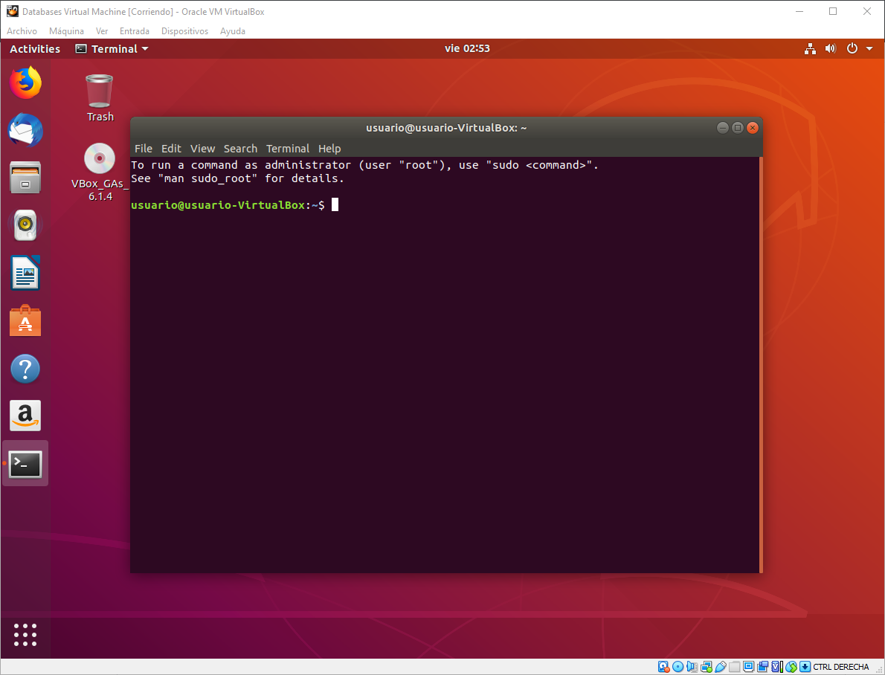
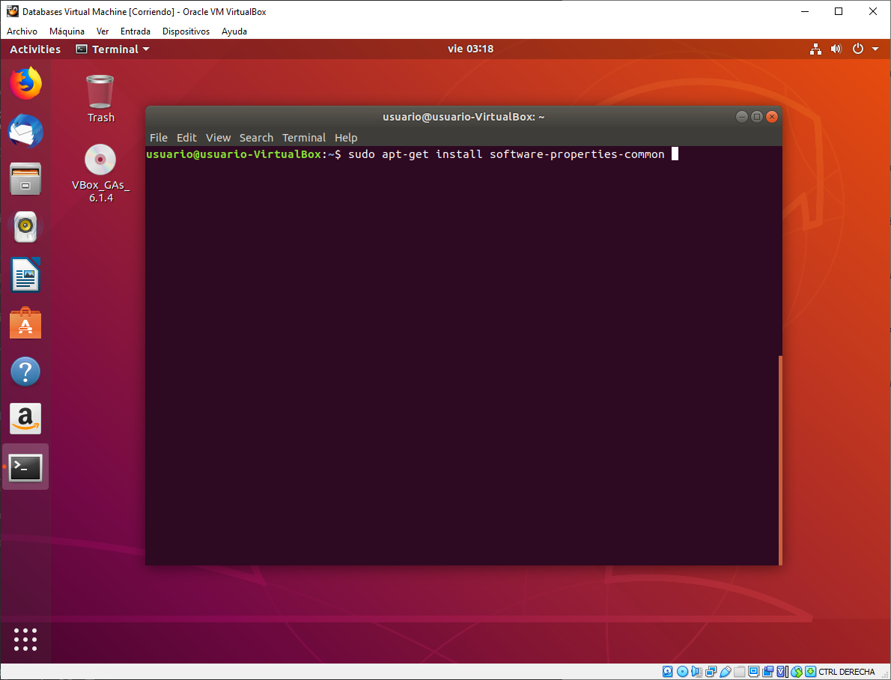
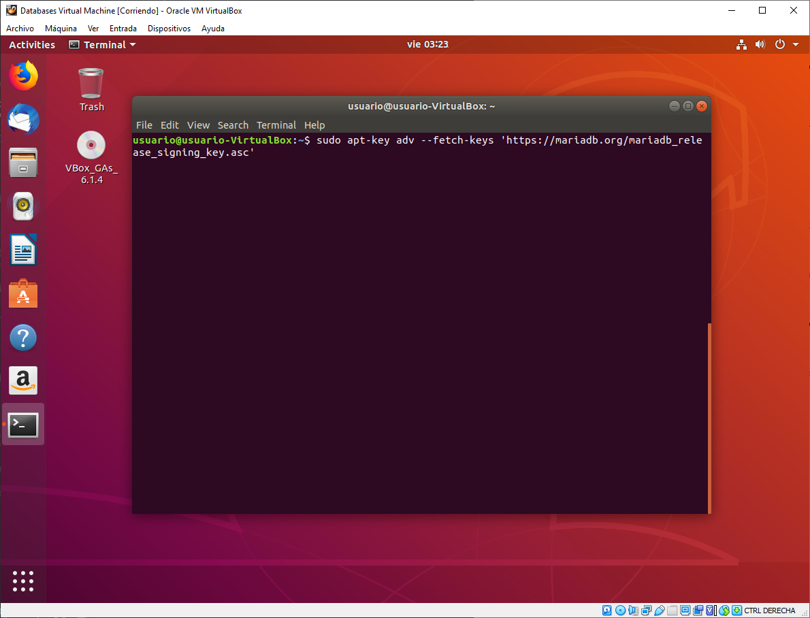
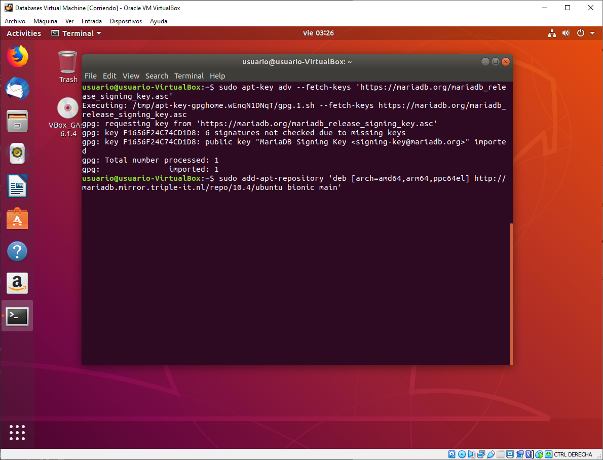
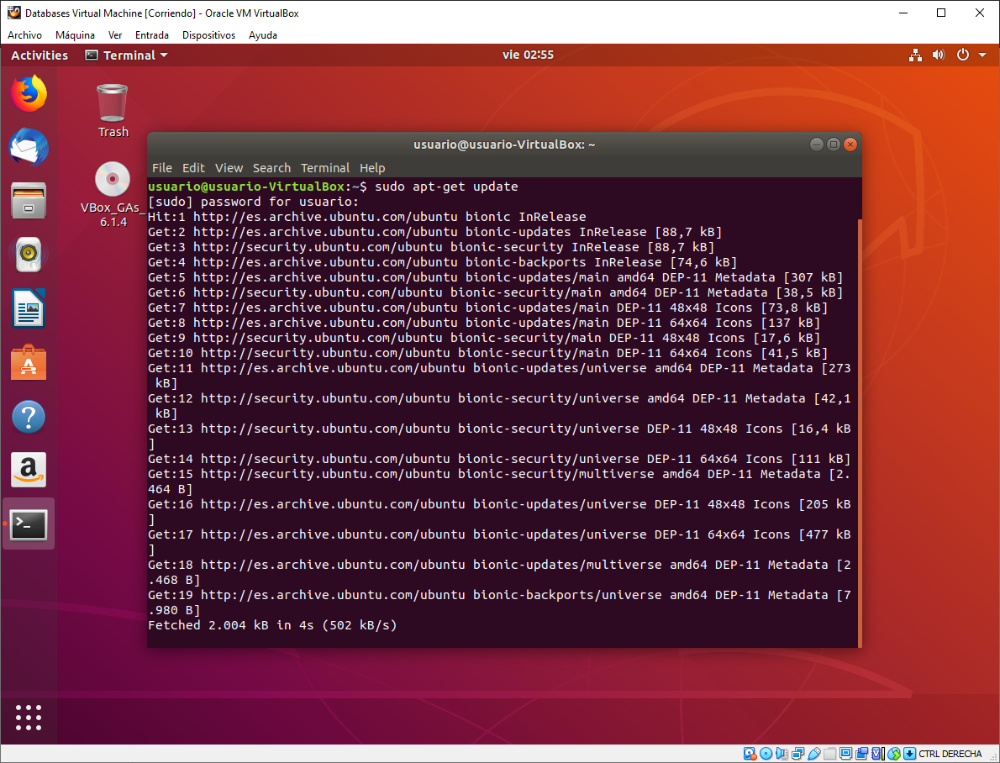
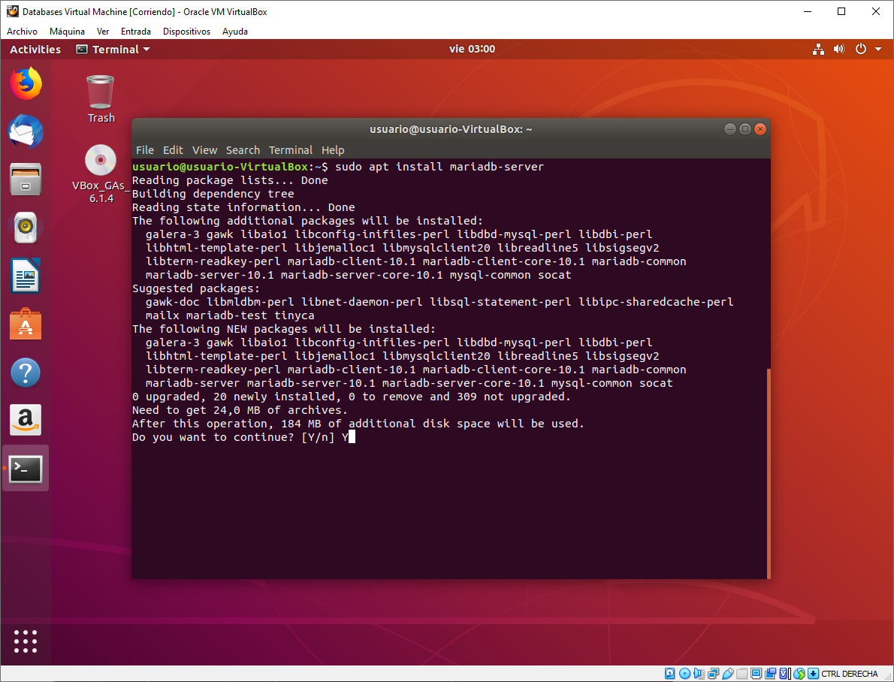
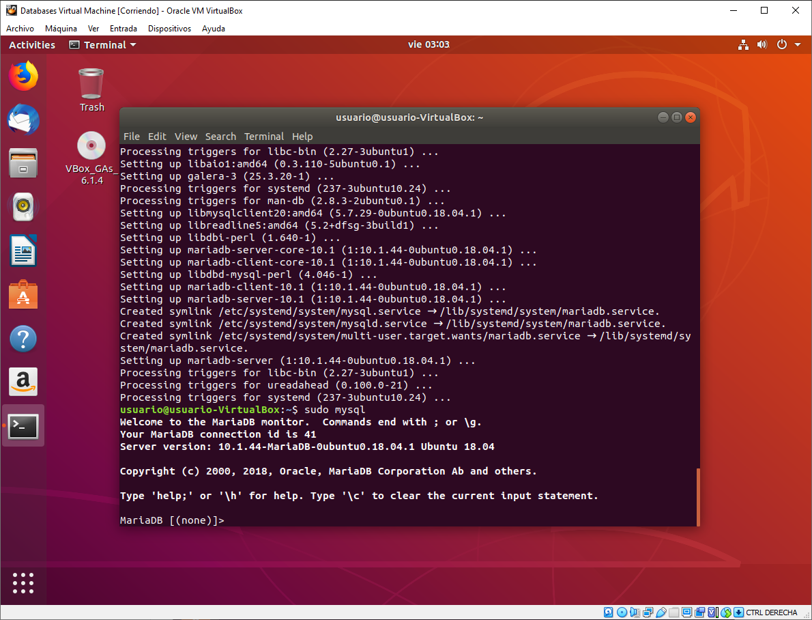
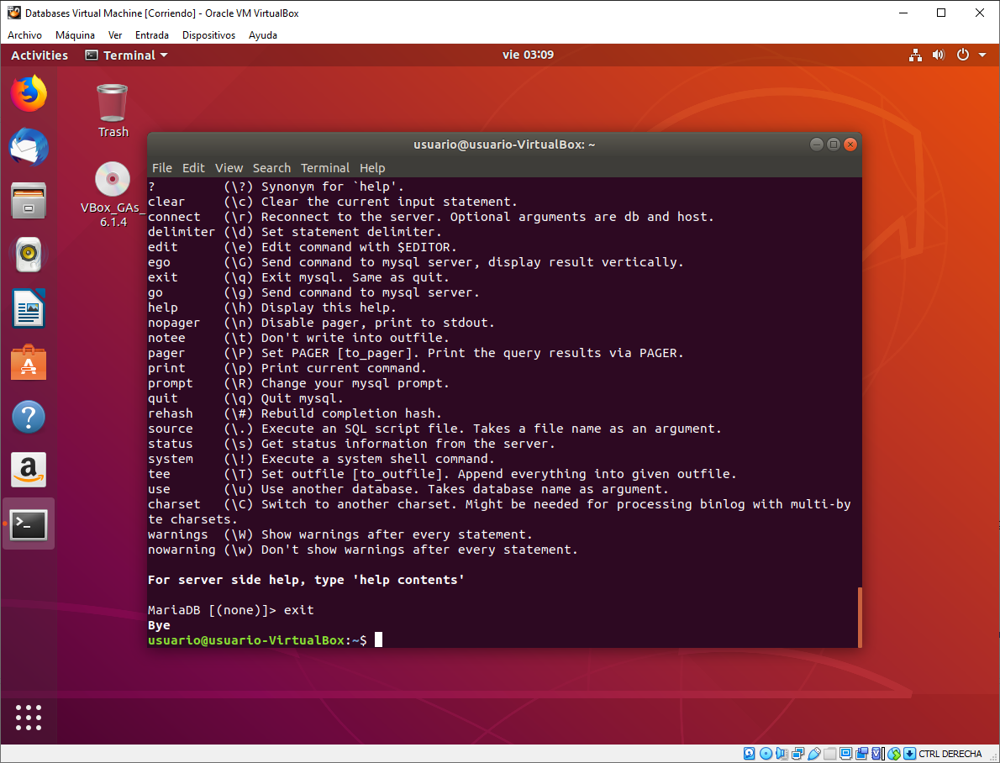

# Tarefa 2

> ----------------------------------------

# MariaDB

## Instalación de MariaDB

Empezamos abriendo una terminal.

Vamos a la página de MariaDB y seleccionamos nuestra versión de Ubuntu. Lo cual nos enseña los pasos que debemos de seguir.

Escribimos el primer paso que nos pone en la página: `sudo apt-get install software-properties-common`

Escribimos el siquiente paso: `sudo apt-key adv --fetch-keys 'https://mariadb.org/mariadb_release_signing_key.asc'`

Y escribimos el último paso de esta parte: `sudo add-apt-repository 'deb [arch=amd64,arm64,ppc64el] http://mariadb.mirror.triple-it.nl/repo/10.4/ubuntu bionic main'`

Después escribimos sudo apt-get update y dejamos que se actualize.

Una vez actualizado escribimos sudo apt install mariadb-server (Le damos a Y en si queremos continuar.)

Cuando se haya instalado, usamos sudo mysql para iniciar el monitor de MariaDB.

Escribir \h (o también \?) nos abre una lista con los comandos que se pueden usar.

Y una vez comprobado que funciona, escribimos exit para salir y MariaDB se despide.

> ----------------------------------------