# Tarefa 3


> ----------------------------------------


## Creación de base de datos Ejemplo 1

Abrimos MariaDB y empezamos creando la base de datos sobre la que vamos a trabajar.

```
CREATE DATABASE Investigacion;
```

Usamos el comando USE para seleccionar la base de datos que acabamos de crear y poder crear tablas dentro de esta.

```
USE Investigacion
```

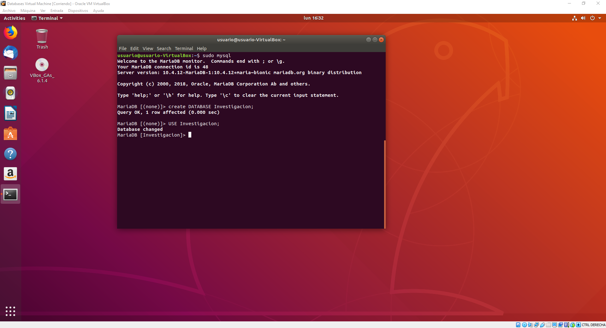
Una vez que tenemos la base de datos seleccionada, podemos empezar a crear las tablas.

La síntaxis de CREATE TABLE es la siguiente:
```
CREATE [OR REPLACE] [TEMPORARY] TABLE [IF NOT EXISTS] tbl_name
    (create_definition,...) [table_options    ]... [partition_options]
```

Para empezar, crearemos la tabla Sede. En mi caso siempre usaré el modo "complejo" de crear las claves primarias para acostumbrarme a ese y que no haya problemas.
Otro detalle importante es que no se puede usar CREATE DOMAIN en MariaDB, por lo tanto tendremos que usar al expresión completa cada vez.

```
CREATE TABLE Sede (
Nome_Sede VARCHAR(30),
Campus    VARCHAR(30)  NOT NULL,
PRIMARY KEY (Nome_Sede)
);
```

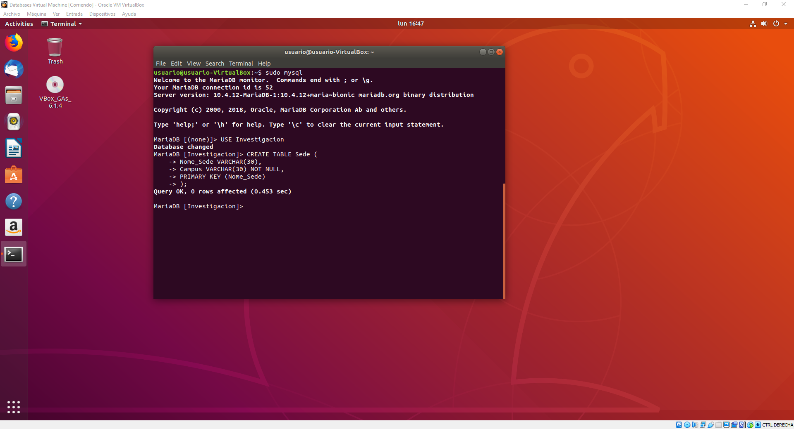

Seguimos con Departamento.

```
CREATE TABLE Departamento (
Nome_Departamento VARCHAR(30),
Teléfono          CHAR(9)      NOT NULL,
Director          CHAR(9),
PRIMARY KEY (Nome_Departamento)
);
```

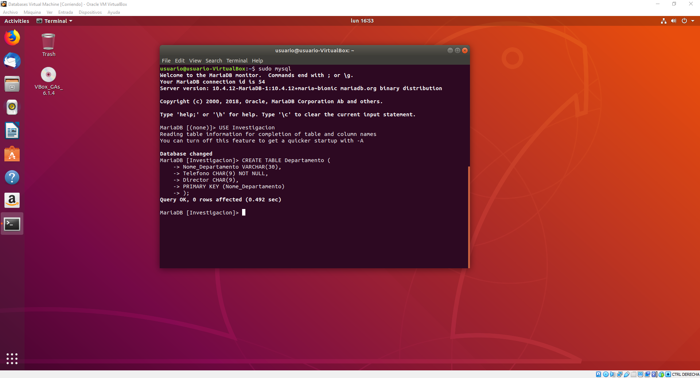


Seguimos con Ubicacion.

```
CREATE TABLE Ubicacion (
Nome_Sede         VARCHAR(30),
Nome_Departamento VARCHAR(30),
PRIMARY KEY (Nome_Sede, Nome_Departamento)
);
```

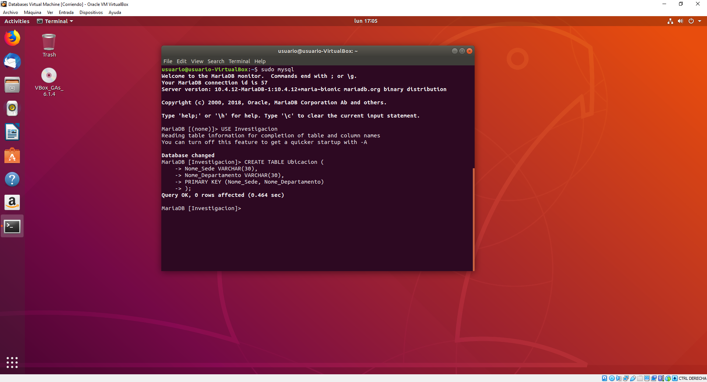


Seguimos con Grupo.

```
CREATE TABLE Grupo (
Nome_Grupo        VARCHAR(30),
Nome_Departamento VARCHAR(30),
Area              VARCHAR(30) NOT NULL,
Lider             VARCHAR(9),
PRIMARY KEY (Nome_Grupo, Nome_Departamento)
);
```

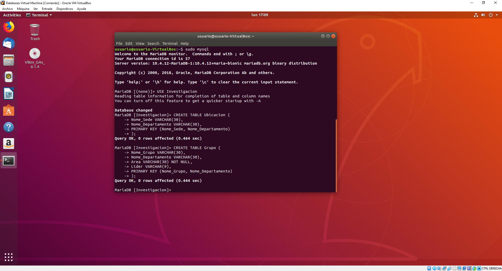


Seguimos con Profesor.

```
CREATE TABLE Profesor (
DNI            VARCHAR(9),
Nome_Profesor  VARCHAR(30) NOT NULL, 
Titulación     VARCHAR(20) NOT NULL,
Experiencia    INTEGER,
N_Grupo        VARCHAR(30),
N_Departamento VARCHAR(30),
PRIMARY KEY (DNI)
);
```

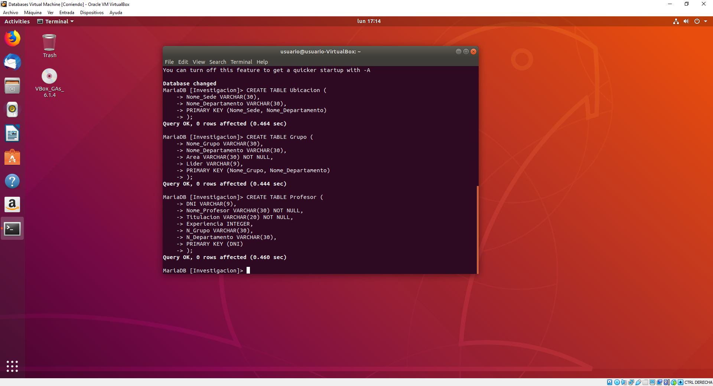


Seguimos con Proxecto.

```
CREATE TABLE Proxecto (
Codigo_Proxecto VARCHAR(5),
Nome_Proxecto   VARCHAR(30)   NOT NULL,
Orzamento       DECIMAL(13,2) NOT NULL,
Data_Inicio     DATE          NOT NULL,
Data_Fin        DATE,
N_Gr            VARCHAR(30),
N_Dep           VARCHAR(30),
UNIQUE (Nome_Proxecto),
PRIMARY KEY (Codigo_Proxecto)
);
```


Seguimos con Participa

```
CREATE TABLE Participa (
DNI             VARCHAR(9),
Codigo_Proxecto VARCHAR(5),
Data_Inicio     DATE        NOT NULL,
Data_Cese       DATE,
Dedicación      INTEGER     NOT NULL,
PRIMARY KEY (DNI, Codigo_Proxecto)
);
```

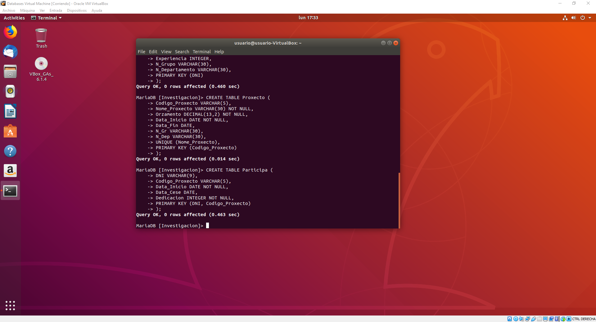


Seguimos con Programa.

```
CREATE TABLE Programa (
Nome_Programa VARCHAR(30),
PRIMARY KEY (Nome_Programa)
); 
```

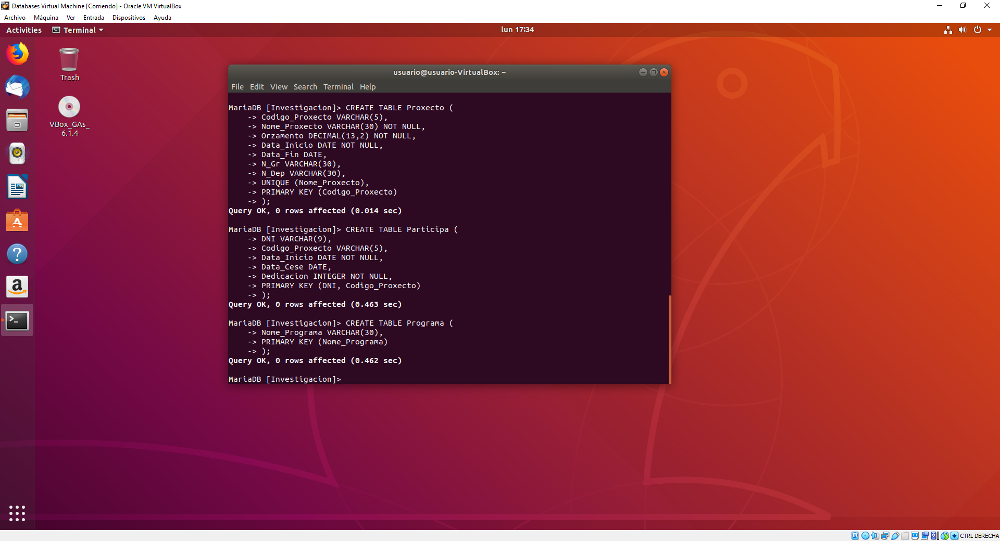

Y terminamos con Financia.

```
CREATE TABLE Financia (
  Nome_Programa        VARCHAR(30),
  Codigo_Proxecto      VARCHAR(9),
  Numero_Programa      VARCHAR(9)     NOT NULL,
  Cantidade_Financiada DECIMAL(13,2)  NOT NULL,
  PRIMARY KEY (Nome_Programa, Código_Proxecto)
);
```

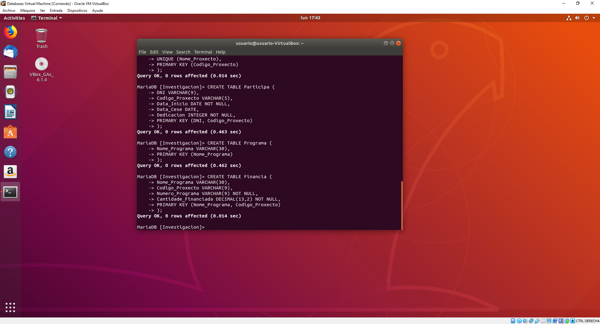

Una vez que hemos terminado creando las tablas, tenemos que crear las claves ajenas alterando las tablas ya creadas.

Sintaxis:

```
ALTER [ONLINE] [IGNORE] TABLE [IF EXISTS] tbl_name
    [WAIT n | NOWAIT]
    alter_specification [, alter_specification] ...
```

Empezamos con la tabla Ubicacion.

```
ALTER TABLE Ubicacion
ADD CONSTRAINT FK_Sede_Ubicacion
FOREIGN KEY (Nome_Sede)
REFERENCES Sede (Nome_Sede)
ON DELETE CASCADE
ON UPDATE CASCADE,
ADD CONSTRAINT FK_Departamento_Ubicacion
FOREIGN KEY (Nome_Departamento)
REFERENCES Departamento (Nome_Departamento)
ON DELETE CASCADE
ON UPDATE CASCADE
;
```


Seguimos con la tabla Grupo.

```
ALTER TABLE Grupo
ADD CONSTRAINT FK_Departamento_Grupo
FOREIGN KEY (Nome_Departamento) 
REFERENCES Departamento (Nome_Departamento)
ON DELETE CASCADE
ON UPDATE CASCADE
;
```


Seguimos con la tabla Profesor.

```
ALTER TABLE Profesor
ADD CONSTRAINT FK_Grupo_Profesor
FOREIGN KEY      (N_Grupo,    N_Departamento)
REFERENCES Grupo (Nome_Grupo, Nome_Departamento)
ON DELETE SET NULL
ON UPDATE CASCADE
;
```

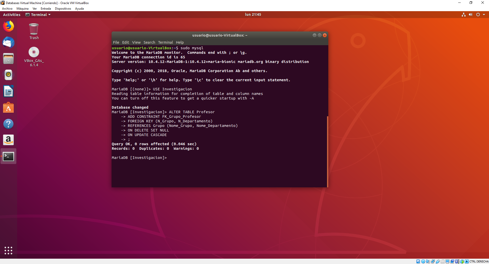

Seguimos con la tabla Proxecto

```
ALTER TABLE Proxecto
ADD CONSTRAINT FK_Grupo_Proxecto
FOREIGN KEY (N_Gr, N_Dep)
REFERENCES Grupo (Nome_Grupo, Nome_Departamento)
ON DELETE SET NULL
ON UPDATE CASCADE
);
```


Serguimos con la tabla Departamento.

```
ALTER TABLE Departamento
ADD CONSTRAINT FK_Profesor_Departamento
FOREIGN KEY (Director)
REFERENCES Profesor (DNI)
ON DELETE SET NULL
ON UPDATE CASCADE
;
```

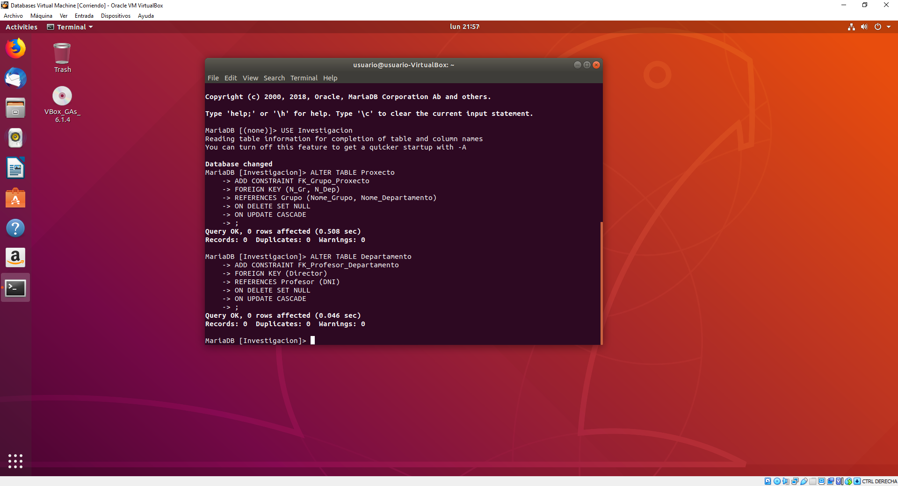

Seguimos con la tabla Grupo.

```
ALTER TABLE Grupo
ADD CONSTRAINT FK_Profesor_Grupo
FOREIGN KEY (Lider)
REFERENCES Profesor (DNI)
ON DELETE SET NULL
ON UPDATE CASCADE
;
```

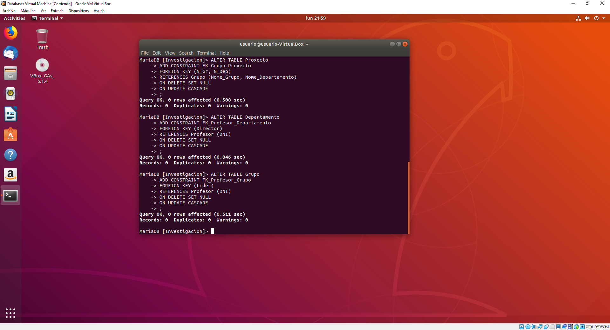

Seguimos con la tabla Participa.

```
ALTER TABLE Participa
ADD CONSTRAINT FK_Profesor_Participa
FOREIGN KEY (DNI)
REFERENCES Profesor (DNI)
ON DELETE NO ACTION
ON UPDATE CASCADE,
ADD CONSTRAINT FK_Proxecto_Participa
FOREIGN KEY (Codigo_Proxecto)
REFERENCES Proxecto (Codigo_Proxecto)
ON DELETE NO ACTION
ON UPDATE CASCADE
;
```


Terminamos con la tabla Financia.

```
ALTER TABLE Financia
ADD CONSTRAINT FK_Proxecto_Financia
FOREIGN KEY (Codigo_Proxecto)
REFERENCES Proxecto (Codigo_Proxecto)
ON DELETE CASCADE
ON UPDATE CASCADE,
ADD CONSTRAINT FK_Programa_Financia
FOREIGN KEY (Nome_Programa)
REFERENCES Programa (Nome_Programa)
ON DELETE CASCADE
ON UPDATE CASCADE;
```

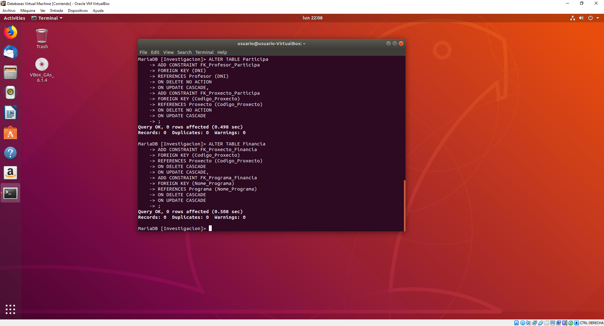

Y añadimos un par de CHECKS al final, usando ALTER.

```
ALTER TABLE Proxecto
ADD CONSTRAINT Check_Dates
CHECK (Data_Inicio < Data_Fin),
```


```
ALTER TABLE Participa
ADD CONSTRAINT Check_Fecha
CHECK (Data_Inicio < Data_Cese)
```

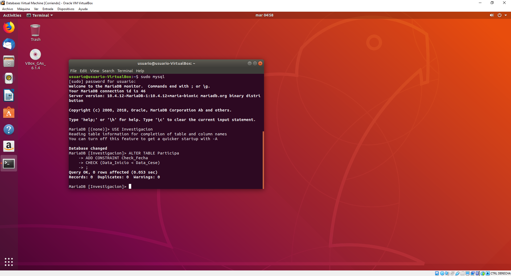


> ----------------------------------------

## Creación de base de datos Ejemplo 2


Abrimos MariaDB y otra vez, creamos la base de datos con la que vamos a trabajar.

```
CREATE DATABASE Naves;
```

Y otra vez, usamos el comando USE para seleccionar esa base de datos.

```
USE Naves
```

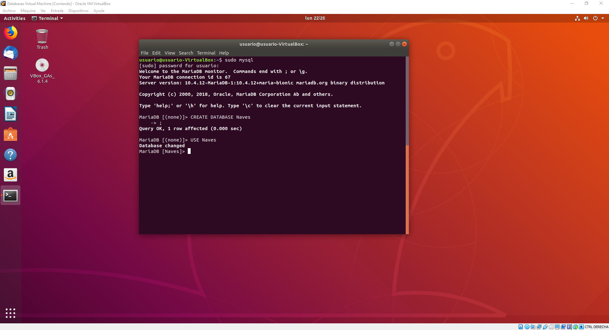

Y, como en el ejemplo 1, empezamos a crear las tablas. Creamos Servizo.

```
CREATE TABLE Servizo (
Clave_Servizo CHAR(5),
Nome_Servizo VARCHAR(40),
PRIMARY KEY (Clave_Servizo, Nome_Servizo)
);
```

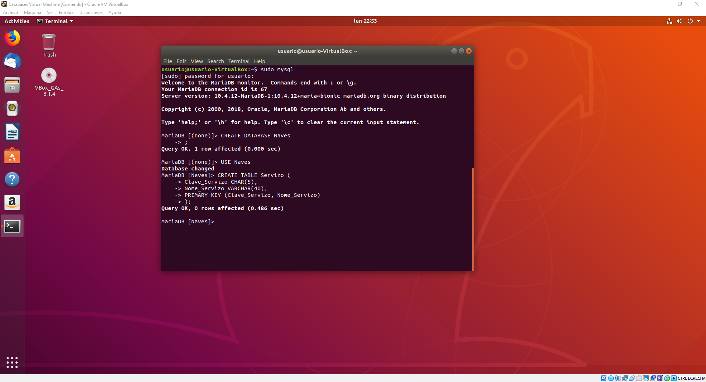

Serguimos con Dependencia.

```
CREATE TABLE Dependencia (
  Codigo_Dependencia CHAR(5),
  Nome_Dependencia   VARCHAR(40) NOT NULL,
  Función            VARCHAR(20),
  Localización       VARCHAR(20),
  Clave_Servizo      CHAR(5) NOT NULL,
  Nome_Servizo       VARCHAR(40) NOT NULL,
  UNIQUE (Nome_Dependencia),
  PRIMARY KEY (Codigo_Dependencia)
);
```

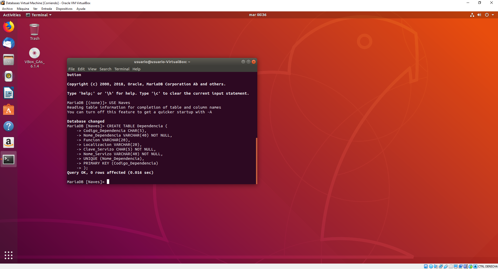

Seguimos con Camara.

```
CREATE TABLE Camara (
  Código_Dependencia CHAR(5),
  Categoría          VARCHAR(40) NOT NULL,
  Capacidade         INTEGER     NOT NULL,
  PRIMARY KEY (Codigo_Dependencia)
);
```


Serguimos con Tripulacion.

```
CREATE TABLE Tripulación (
  Código_Tripulación CHAR(5),
  Nome_Tripulación   VARCHAR(40),
  Categoría          CHAR(20)    NOT NULL,
  Antigüidade        INTEGER     DEFAULT 0,
  Procedencia        CHAR(20),
  Adm                CHAR(20)    NOT NULL,
  Código_Dependencia CHAR(5) NOT NULL,
  Código_Cámara      CHAR(5) NOT NULL,
PRIMARY KEY (Codigo_Tripulacion)
);
```

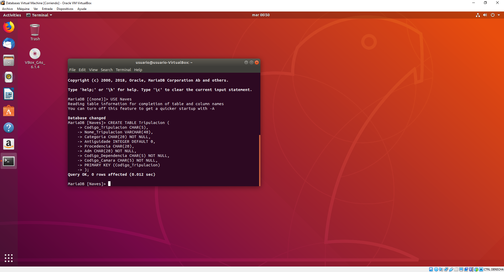

Seguimos con Planeta.

```
CREATE TABLE Planeta (
  Código_Planeta CHAR(5),
  Nome_Planeta   VARCHAR(40) NOT NULL,
  Galaxia        CHAR(15)    NOT NULL,
  Coordenadas    CHAR(15)    NOT NULL,
  UNIQUE (Coordenadas, Nome_Planeta),
PRIMARY KEY (Codigo_Planeta)
 );
```

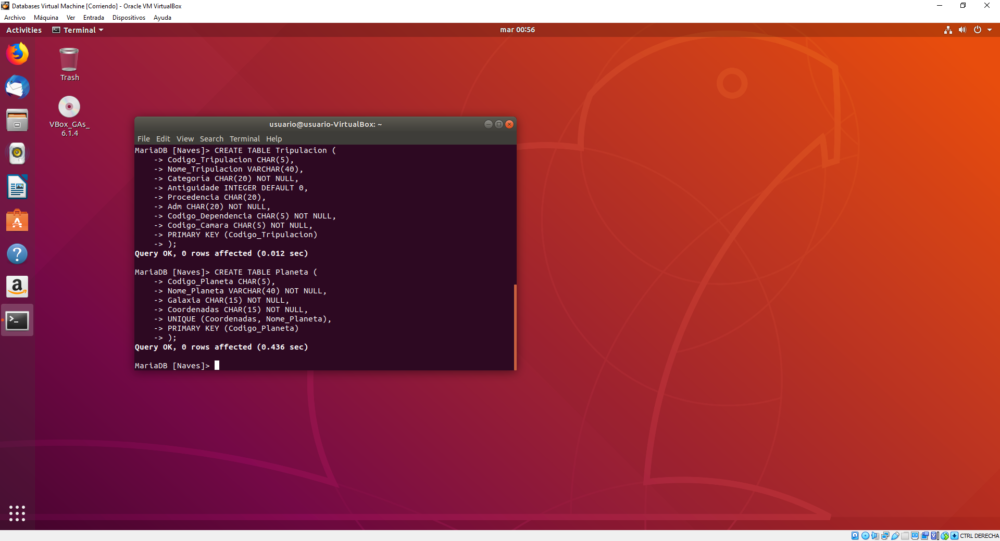

Seguimos con Visita.

```
CREATE TABLE Visita (
  Código_Tripulación CHAR(5),
  Código_Planeta     CHAR(5),
  Data_Visita        DATE,
  Tempo              INTEGER      NOT NULL,
  PRIMARY KEY (Código_Tripulación, Código_Planeta, Data_Visita)
);
```


Seguimos con Habita.

```
CREATE TABLE Habita (
  Código_Planeta    CHAR(5),
  Nome_Raza         VARCHAR(40),
  Poboación_Parcial INTEGER     NOT NULL,
  PRIMARY KEY (Código_Planeta, Nome_Raza)
);
```

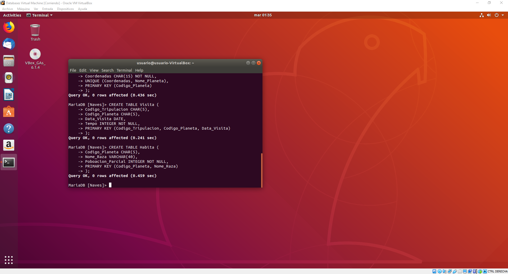

Y terminamos con Raza.

```
CREATE TABLE Raza (
  Nome_Raza       VARCHAR(40),
  Altura          INTEGER      NOT NULL,
  Anchura         INTEGER      NOT NULL,
  Peso            INTEGER      NOT NULL,
  Poboación_Total INTEGER      NOT NULL,
PRIMARY KEY (Nome_Raza)
);
```

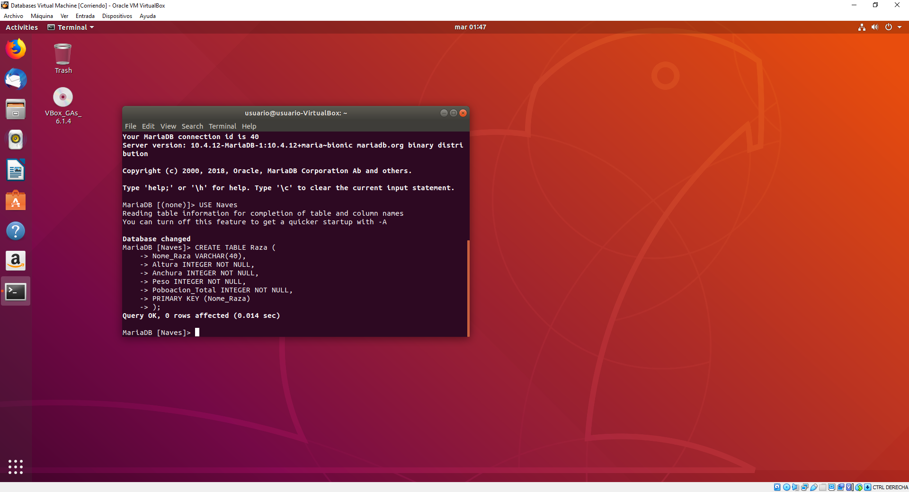

Una vez que hemos creado las tablas tenemos que hacer como el primer ejemplo, empezar a usar ALTER para modificar las tablas y añadir las claves ajenas.

Empezamos por la tabla Dependencia.

```
ALTER TABLE Dependencia
ADD CONSTRAINT FK_Servizo_Dependencia
FOREIGN KEY (Clave_Servizo, Nome_Servizo)
REFERENCES Servizo (Clave_Servizo, Nome_Servizo)
ON DELETE CASCADE
ON UPDATE CASCADE
;
```

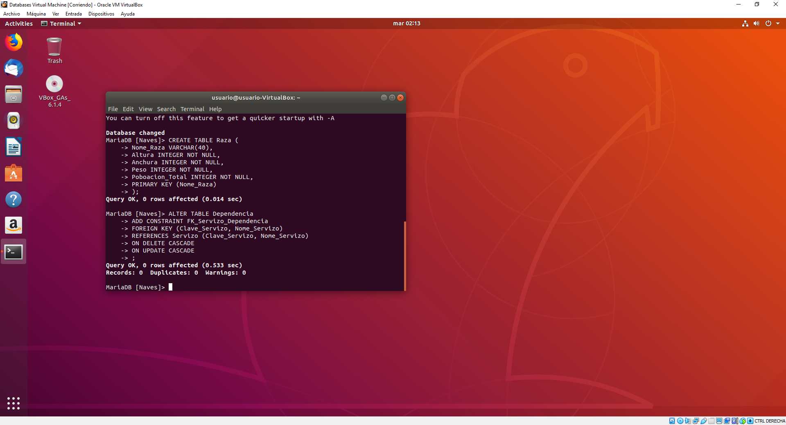

Seguimos con la tabla Camara.

```
ALTER TABLE Camara
ADD CONSTRAINT FK_Dependencia_Camara
 FOREIGN KEY (Codigo_Dependencia)
    REFERENCES Dependencia (Codigo_Dependencia)
    ON DELETE CASCADE
    ON UPDATE CASCADE
;
```

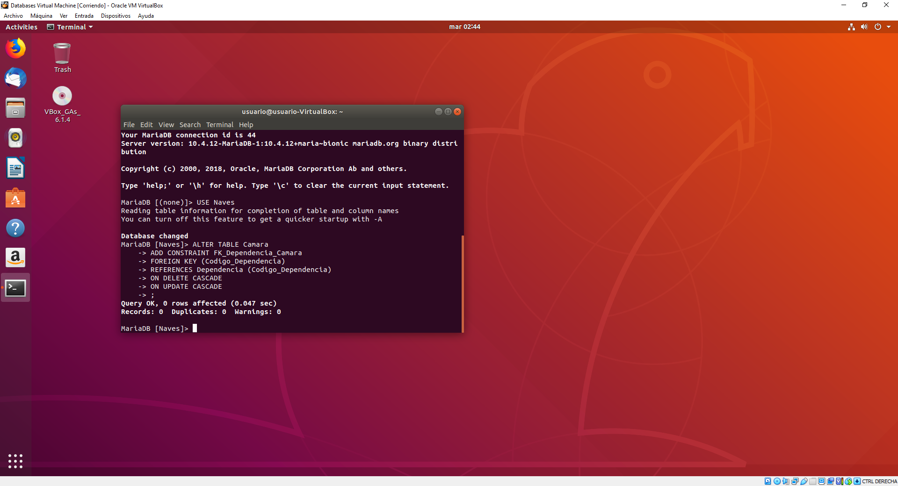

Seguimos con la tabla Tripulacion.

```
ALTER TABLE Tripulacion
ADD CONSTRAINT FK_Camara_Tripulacion
 FOREIGN KEY (Codigo_Camara)
    REFERENCES Cámara (Codigo_Dependencia)
    ON UPDATE CASCADE
    ON DELETE CASCADE
;
```


Seguimos con la tabla Tripulacion.

```
ALTER TABLE Tripulacion
ADD CONSTRAINT FK_Dependencia_Tripulacion 
FOREIGN KEY (Codigo_Dependencia)
REFERENCES Dependencia (Codigo_Dependencia)
ON UPDATE CASCADE
ON DELETE CASCADE
;
```


Seguimos con la tabla Visita.

```
ALTER TABLE Visita
ADD CONSTRAINT FK_Tripulacion_Visita
FOREIGN KEY (Codigo_Tripulacion)
    REFERENCES Tripulación (Codigo_Tripulacion)
    ON UPDATE CASCADE
    ON DELETE CASCADE,
ADD CONSTRAINT FK_Planeta_Visita
  FOREIGN KEY (Codigo_Planeta)
    REFERENCES Planeta (Codigo_Planeta)
    ON UPDATE CASCADE
    ON DELETE CASCADE 
);
```


Seguimos con la tabla Habita.

```
ALTER TABLE Habita
ADD CONSTRAINT FK_Planeta_Habita
 FOREIGN KEY (Código_Planeta)
    REFERENCES Planeta (Código_Planeta)
    ON UPDATE CASCADE
    ON DELETE CASCADE
;
```

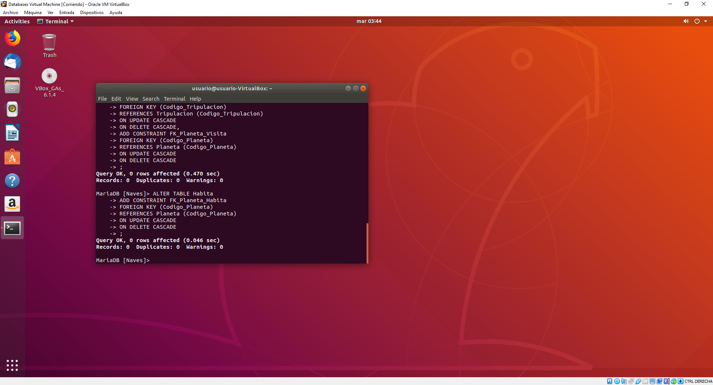

Y terminamos otra vez con la tabla Habita.

```
ALTER TABLE Habita
  ADD CONSTRAINT FK_Raza
    FOREIGN KEY (Nome_Raza)
      REFERENCES Raza
      ON UPDATE CASCADE
      ON DELETE CASCADE
;
```

Finalmente, añadimos un CHECK con ALTER.

```
ALTER TABLE Camara
ADD CONSTRAINT Capacidade_maior_de_cero
CHECK (capacidade > 0);
```

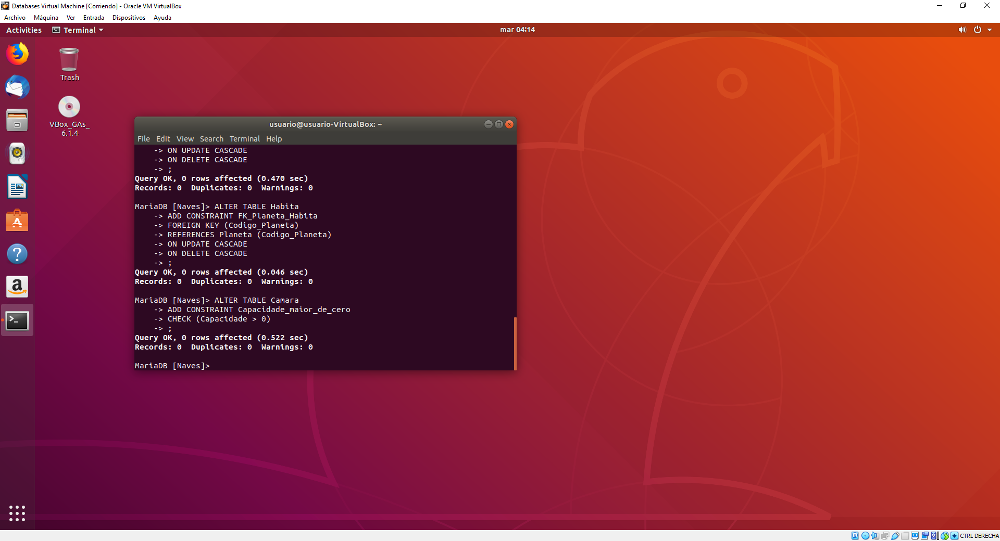


> ----------------------------------------