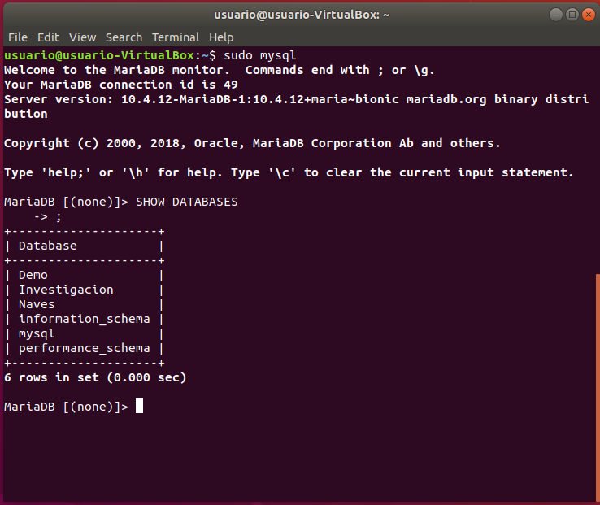
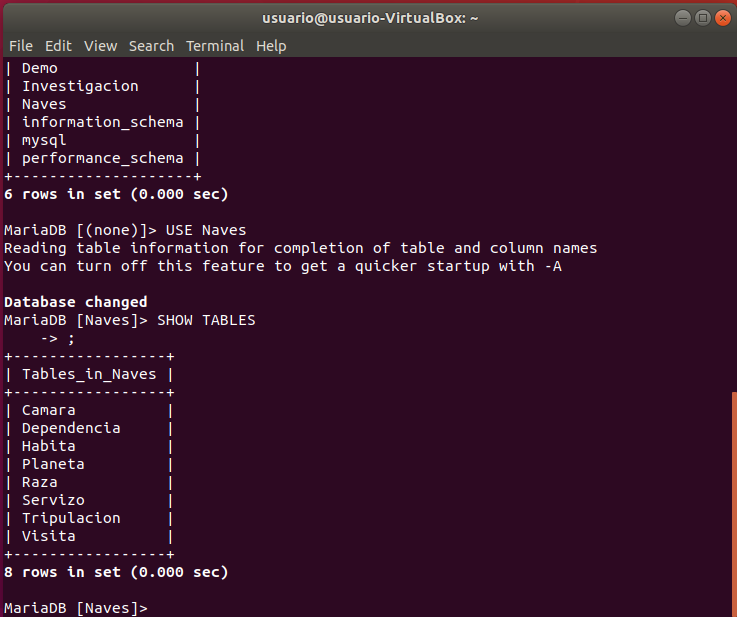
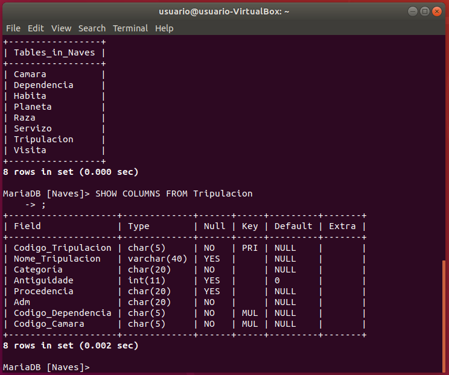
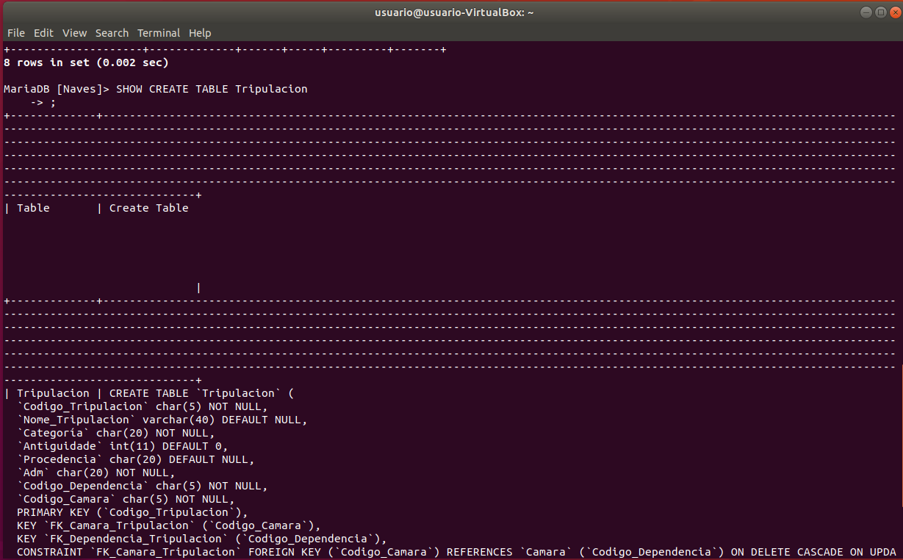
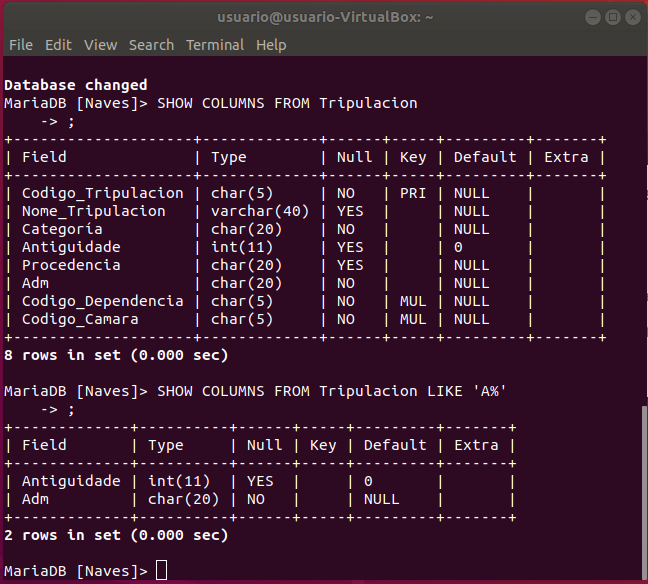
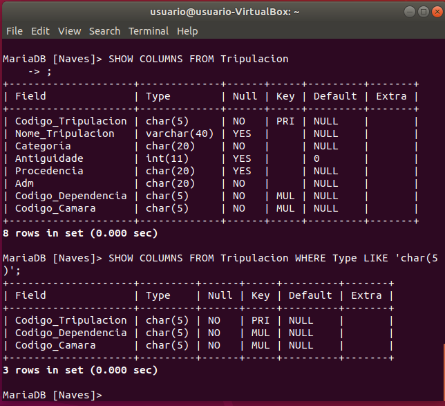
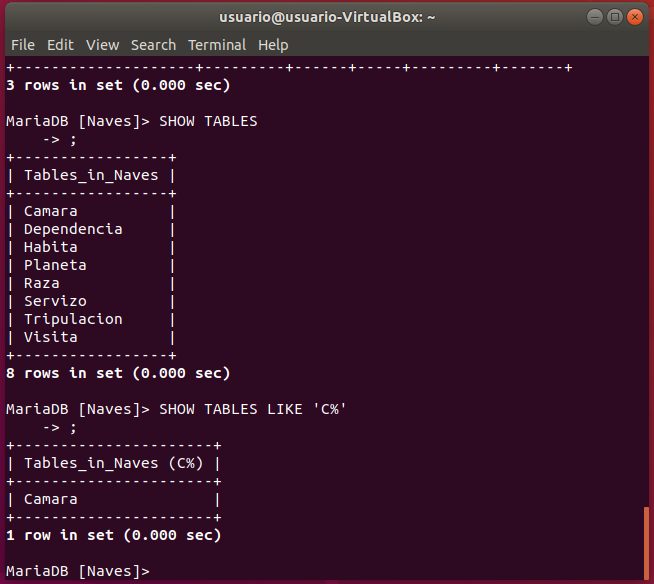
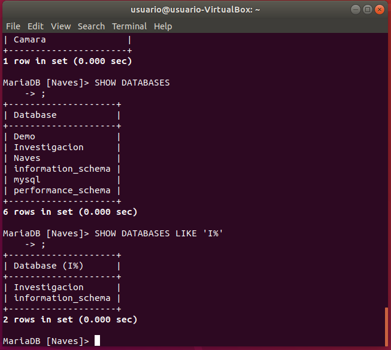

# Tarefa 4


> ----------------------------------------


# Índice

- [MariaDB](#MariaDB)

    - [Meta uso MariaDB](#Meta-uso-MariaDB)

        - [SHOW DATABASES](#SHOW-DATABASES)

        - [SHOW TABLES](#SHOW-TABLES)

        - [SHOW COLUMNS](#SHOW-COLUMNS)

        - [SHOW CREATE TABLE](#SHOW-CREATE-TABLE)

        - [WHERE y LIKE](#WHERE-y-LIKE)


> ----------------------------------------


## Meta uso MariaDB

### SHOW DATABASES

```
SHOW {DATABASES | SCHEMAS}
    [LIKE 'pattern' | WHERE expr]
```

El comando más básico para usar la consola de comandos para visualizar nuestras bases de datos de forma gráfica es el comando SHOW DATABASES, el cual nos permite ver las bases de datos que tenemos creadas.



### SHOW TABLES

```
SHOW [FULL] TABLES [FROM db_name]
    [LIKE 'pattern' | WHERE expr]
```

Una vez que accedamos a una base de datos, podemos usar SHOW para que nos enseñe las tablas de la base de datos, usando SHOW TABLES.
También podemos usar  SHOW TABLES FROM para ver las tablas de una base de datos sin tener que acceder a ella primero.



### SHOW COLUMNS

```
SHOW [FULL] {COLUMNS | FIELDS} FROM tbl_name [FROM db_name]
    [LIKE 'pattern' | WHERE expr]
```

Y el mismo comando SHOW nos permite ver las columnas de una tabla, con la informacion extra que nos proporciona.



### SHOW CREATE TABLE

```
SHOW CREATE TABLE tbl_name
```

Usando SHOW CREATE TABLE también nos permite ver como se ha creado la tabla. (También existe SHOW CREATE DATABASE).



### WHERE y LIKE

Con SHOW COLUMNS también se puede usar WHERE y LIKE para especificar los datos que queremos sacar.
Por ejemplo, si usamos LIKE 'A%' sacamos solo las columnas que empiezan por A. Esto también se puede usar con SHOW DATABASES y con SHOW TABLES.


Usando LIKE con columnas:



Usando WHERE y LIKE para sacar cada columna que sea de un tipo concreto:



Usando LIKE con tablas:



Usando LIKE con bases de datos:




> ----------------------------------------
